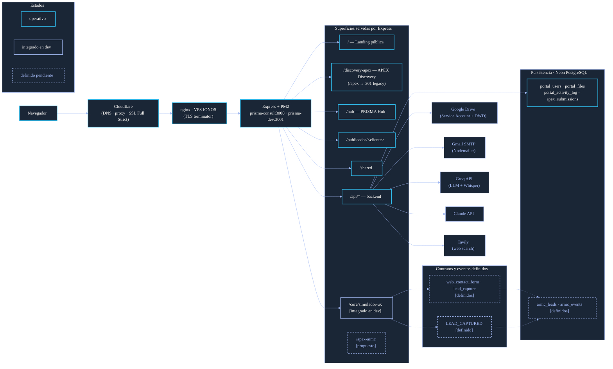

# ARQUITECTURA — Vista canónica técnica del repo

> **Estado:** vigente · **Última verificación:** 2026-07-23
>
> Vista canónica de arquitectura técnica del repo `web-de-prisma`, nivel
> contenedor. **El proyecto está en construcción**, así que esta vista
> refleja el sistema con **estados explícitos por pieza** — no es una
> foto del runtime ni una proyección aspiracional.
>
> Mantenida por el Ejecutor 1 (`docs/OPERATIVA.md` §1). Complementa, no
> sustituye, a [`CLAUDE.md`](../CLAUDE.md), [`CONTRATOS.md`](../CONTRATOS.md)
> y [`MODELO-DOMINIO.md`](../MODELO-DOMINIO.md).
>
> La visualización Mermaid adopta el lenguaje cromático y de conexiones
> del sistema actual. Paleta heredada de `prisma-apex/hub.css`; markers
> de flecha del simulador en `prisma-apex/hub-analisis.js` (base suave,
> activa y excepción/riesgo).

## 1. Propósito y límites

Este documento responde a **qué piezas existen, en qué estado están, cómo
se conectan, de qué dependen y qué runtime real las soporta**, en nivel
contenedor. No describe el producto (`CLAUDE.md`), ni el modelo de
dominio (`MODELO-DOMINIO.md`), ni los contratos externos (`CONTRATOS.md`).

### Estados utilizados en esta vista

- **operativo** — vive en producción (`prismaconsul.com`).
- **integrado en dev** — vive en `dev.prismaconsul.com`. No tocado en
  producción aún.
- **definido y pendiente de integración** — definición canónica presente
  en el repo (esquema, contrato, módulo) pero el backend operativo no la
  consume todavía. F2 / F3 contribuyen aquí; la integración efectiva la
  cierra el Ejecutor 1 (§1 de `OPERATIVA.md`).

El estado **propuesto** se utiliza por primera vez en esta versión para
reflejar `/apex-armc` (engagement APEX para ARMC, no existe aún).
Definición canónica del nombre en `GLOSARIO.md` §10; su naturaleza
funcional queda pendiente de definición en un slice posterior.

### Dentro del alcance

- Las superficies que el sistema sirve, sus mounts reales y su estado.
- Persistencia, separando lo operativo hoy de lo definido pendiente.
- Integraciones externas y su estado.
- Runtime que soporta el sistema en producción y desarrollo.
- Mecanismos de autenticación nombrados.

### Fuera del alcance

- Detalle de campos, columnas o lógica de negocio.
- Contenido en curso de F2 (blueprint) y F3 (simulador) que no tenga
  definición canónica congelada en el repo.
- Incidencias operativas históricas.
- Mapa del ecosistema multi-repo (vive en [`ECOSISTEMA.md`](../ECOSISTEMA.md)).

## 2. Vista de contenedores

**Lectura del diagrama:**

- Trazo sólido cyan = pieza **operativa** en producción.
- Trazo sólido soft-blue = pieza **integrada en dev**.
- Trazo punteado soft-blue = pieza **definida** canónicamente pero
  **pendiente de integración** en backend.
- Flechas punteadas representan dependencias entre piezas definidas pero
  todavía no ejecutadas en runtime.
- `/apex-armc` aparece etiquetado como `[propuesto]` y, por economía
  visual en esta versión, reutiliza temporalmente el trazo punteado sin
  implicar todavía pieza definida pendiente de integración.

## 3. Módulos internos

| Módulo | Path | Mount | Estado |
|---|---|---|---|
| Landing pública | `web/` | `/` (raíz) | operativo |
| APEX Discovery | `prisma-apex/core/discovery-engine/` | `/discovery-apex` (canónico desde `v3.5.0`) · `/apex` (`301` legacy) | operativo (público — sin login) |
| PRISMA Hub | `prisma-apex/index.html` + `hub-*.{css,js}` | `/hub` | operativo |
| Entregables por cliente | `prisma-apex/clientes-publicados/<cliente>/` | `/publicados/<cliente>/` | operativo (hoy solo ARMC) |
| Recursos compartidos | `shared/` | `/shared` | operativo |
| Backend Express | `server/server.js`, `server/routes/`, `server/middleware/`, `server/lib/` | `/api/*` | operativo |
| Simulador UX | `prisma-apex/core/simulador-ux/` | `/core/simulador-ux` | integrado en dev *(prod nginx pendiente, ver §8 de OPERATIVA)* |
| Engagement APEX-ARMC | `prismaconsul.com/apex-armc` (futuro, no existe aún) | — | propuesto — naturaleza funcional pendiente (ver `GLOSARIO.md` §10) |

**Compatibilidades de URL** (configuradas en `server/server.js`):

- `/portal/analisis/*` → `301` a `/publicados/...` — **operativo**.
- `/publicados/armc/simulador-ux/*` → `301` al Hub — **operativo**.

## 4. Persistencia y datos

### 4.1. Persistencia operativa actual

Una sola base de datos compartida por producción y desarrollo:

- **Neon PostgreSQL** (serverless, accedido vía `@neondatabase/serverless`
  desde `server/routes/portal.js`, `server/routes/apex.js` y
  `server/lib/`).

Tablas declaradas en `server/schema.sql`:

| Tabla | Función | Estado |
|---|---|---|
| `portal_users` | Cuentas del Hub (admin / user). | operativo |
| `portal_files` | Documentos servidos al Hub vía Drive. | operativo |
| `portal_activity_log` | Auditoría de actividad del portal. | operativo |
| `apex_submissions` | Envíos completados de APEX Discovery. | operativo |

### 4.2. Persistencia definida y pendiente de integración

Definida canónicamente en
`prisma-apex/core/simulador-ux/capa-3-sql/schema.sql`. **No** está en
`server/schema.sql` ni el backend escribe en ella todavía. Forma parte
del modelo del simulador y se integrará cuando el carril correspondiente
lo cierre.

| Tabla | Función | Estado | Origen canónico |
|---|---|---|---|
| `armc_leads` | Leads capturados (web / WhatsApp). Incluye **seis columnas aditivas de handoff** humano: `handoff_state`, `handoff_assigned_to`, `handoff_close_reason`, `handoff_requested_at`, `handoff_assigned_at`, `handoff_closed_at`. | definido y pendiente | `simulador-ux/capa-3-sql/schema.sql` |
| `armc_events` | Eventos del flujo (`LEAD_CAPTURED`, `HUMAN_HANDOFF_REQUESTED`, `HUMAN_HANDOFF_ASSIGNED`, `HUMAN_HANDOFF_CLOSED`). | definido y pendiente | `simulador-ux/capa-3-sql/schema.sql` |
| `armc_handoffs` | Historial completo del handoff humano: una fila por cada transición `REQUESTED / ASSIGNED / CLOSED`. Conserva trazabilidad de quién pidió, asignó, reasignó y cerró. | definido y pendiente | `simulador-ux/capa-3-sql/schema.sql` |

**Relación técnica con `portal_users`:** las nuevas claves foráneas
`armc_leads.handoff_assigned_to`, `armc_handoffs.user_id` y
`armc_handoffs.reassigned_from_user_id` apuntan a `portal_users(id)`
(`ON DELETE SET NULL`). Es relación técnica entre tablas; **no introduce
un actor humano nuevo en la captación** — `portal_users` ya existe como
tabla operativa de cuentas del Hub (§4.1) y se reusa para resolver la
identidad del humano que atiende cada handoff.

Detalle del modelo:
[`MODELO-DOMINIO.md`](../MODELO-DOMINIO.md) y
`prisma-apex/core/simulador-ux/capa-3-sql/data-dictionary.md`.

### 4.3. Contratos y eventos definidos (capa 2 del simulador)

Definiciones canónicas en
`prisma-apex/core/simulador-ux/capa-2-diccionario/`. El backend operativo
no los procesa todavía.

| Contrato / evento | Tipo | Estado | Origen canónico |
|---|---|---|---|
| `web_contact_form` | Form de captación canal web | definido y pendiente | `forms/web-contact-form.json` |
| `lead_capture` | Form de captación canal WhatsApp | definido y pendiente | `forms/lead-capture.json` |
| `LEAD_CAPTURED` | Evento de convergencia | definido y pendiente | `capa-2-diccionario/` |

## 5. Dependencias externas

| Servicio | Uso | Origen del secreto | Cliente | Estado |
|---|---|---|---|---|
| Neon PostgreSQL | Persistencia principal | `DATABASE_URL` | `@neondatabase/serverless` | operativo |
| Google Drive | Almacenamiento y servido de documentos del Hub | `GOOGLE_SERVICE_ACCOUNT_KEY`, `GOOGLE_DRIVE_FOLDER_ID` | Service Account + DWD impersonando `info@prismaconsul.com` | operativo |
| Gmail SMTP | Envío transaccional | `SMTP_USER`, `SMTP_PASS` | Nodemailer | operativo |
| Groq | LLM + Whisper | `GROQ_API_KEY` | HTTP directo | operativo |
| Claude API | LLM | `CLAUDE_API_KEY` | HTTP directo | operativo |
| Tavily | Búsqueda web | `TAVILY_API_KEY` | HTTP directo | operativo |

Las dependencias se invocan exclusivamente desde el backend Express. El
frontend nunca lleva claves externas.

**Protección de cuotas (P-7, `v3.5.6`) — operativo:** los 5 endpoints
públicos del discovery que consumen Groq/Claude/Tavily llevan rate
limiting por IP real en Express (`server/middleware/rate-limit.js`;
bucket pesado 15/h, bucket interactivo 60/h, `keyGenerator` explícito
`CF-Connecting-IP` → `X-Forwarded-For` → `req.ip`, sin `trust proxy`)
más blindaje de parámetros (whitelist de modelos Groq y tope de
`max_tokens` servidor). Detalle contractual en `CONTRATOS.md` §4.10.

## 6. Runtime e infraestructura

Todo en estado **operativo**:

- **VPS IONOS** (Ubuntu 24.04, IP `212.227.251.125`).
- **nginx** terminador de TLS (Let's Encrypt) + `proxy_pass` hacia
  Express.
- **PM2** mantiene dos procesos sobre el mismo host:
  - `prisma-consul` (producción, puerto 3000) →
    `/home/prisma/web-de-prisma/`.
  - `prisma-dev` (desarrollo, puerto 3001) →
    `/home/prisma/web-de-prisma-dev/`.
- **Cloudflare** delante de ambos entornos: DNS + proxy + SSL/TLS *Full
  (Strict)*.
- **Dominios:** `prismaconsul.com` (prod) y `dev.prismaconsul.com` (dev).

Compatibilidad temporal vigente: nginx de producción aún no enruta
`/core/simulador-ux/`. Registrada en `docs/OPERATIVA.md` §8 con su
condición de retirada.

Detalle operativo del servidor (securización, backups, deploy automático)
en el repo `prisma-server-ops`.

## 7. Autenticación y secretos nombrados

### 7.1. Autenticación de usuarios — operativo

- JWT con `bcryptjs`, expiración 24h.
- Roles: `admin` y `user`. Implementado en `server/routes/portal.js`.
- Auth compartida APEX / Hub.
- Secreto de firma: `PORTAL_SECRET`.

### 7.2. Autenticación de servicios externos — operativo

- Google Drive — Service Account con domain-wide delegation (DWD), clave
  JSON en `GOOGLE_SERVICE_ACCOUNT_KEY`. Impersona
  `info@prismaconsul.com`.
- Gmail SMTP — `SMTP_USER` + `SMTP_PASS`.
- Resto de APIs externas — API key plana en `.env`.

### 7.3. Convención de secretos

- Todos los secretos viven en `.env` por entorno, **nunca** en repo.
- Variables esperadas: `GROQ_API_KEY`, `TAVILY_API_KEY`, `CLAUDE_API_KEY`,
  `DATABASE_URL`, `SMTP_USER`, `SMTP_PASS`, `PORTAL_SECRET`,
  `GOOGLE_SERVICE_ACCOUNT_KEY`, `GOOGLE_DRIVE_FOLDER_ID`.
- Solo se nombran aquí. Cualquier rotación o ampliación se gestiona
  contra el VPS y el repo de ops, no contra este documento.

## 8. Referencias

- [`CLAUDE.md`](../CLAUDE.md) — overview del producto, design system,
  versionado, workflow git.
- [`CONTRATOS.md`](../CONTRATOS.md) — contratos externos y reglas sobre
  ellos.
- [`MODELO-DOMINIO.md`](../MODELO-DOMINIO.md) — modelo de dominio
  canónico.
- [`docs/OPERATIVA.md`](OPERATIVA.md) — modo de trabajo, carriles,
  estados y cierre de slice.
- [`REGISTRO-RUTAS.md`](../REGISTRO-RUTAS.md) — registro de rutas
  canónicas y compatibilidades.
- [`ECOSISTEMA.md`](../ECOSISTEMA.md) — mapa del ecosistema multi-repo.
- `server/server.js` — orden de mounts y handlers reales.
- `server/schema.sql` — esquema vigente del backend operativo.
- `prisma-apex/core/simulador-ux/capa-3-sql/schema.sql` — esquema
  canónico del simulador (definido y pendiente).
- `prisma-apex/core/simulador-ux/capa-2-diccionario/` — contratos y
  eventos canónicos del simulador.
- `prisma-apex/hub.css` — paleta cromática heredada por esta vista.
- `prisma-apex/hub-analisis.js` — markers de flecha del simulador
  heredados por esta vista.
